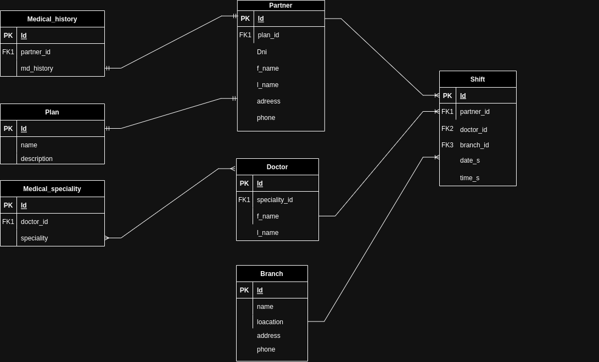

# MIS_MEDICAL
Proyecto final para el curso de [CODERHOUSE - SQL](https://www.coderhouse.com/online/sql)
## Descripción del Modelo
Este modelo representa el sistema de asignación de turnos en una agenda médica de una prepaga.

## DER (Diagrama entidad-relación)

### Schema
El schema donde se aloja el modelo será el p_medical

|        Tabla        |          Descripción                      
|---------------------|------------------------------------|
|`Partner`            |Socios (afiliados) de la prepaga    |
|`Doctor`             |Doctores de la prepaga              |
|`Branch`             |Sucursales                          |
|`Shift`              |Turnos médicos                      |
|`Plan`               |Planes que ofrece la prepaga        |
|`Medical_history`    | Historial médico del socio         |
|`Medical_speciality` |Especialidades médicas de la prepaga|
